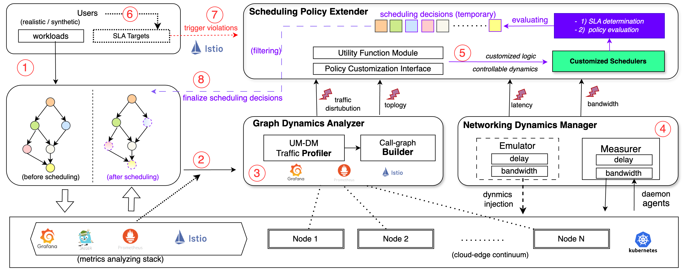

# iDynamics: A Configurable Emulation Framework for evaluating Microservice Scheduling Policies under Controllable Cloud–Edge Dynamics

iDynamics is a configurable emulation framework for evaluating microservice scheduling policies on Kubernetes-based cloud–edge clusters under *controllable dynamics* (call-graph, traffic, and network conditions). 

The repository hosts the research prototype used in our iDynamics papers and provides a basis for implementing and testing new scheduling policies against realistic but repeatable conditions.

---

## What is “controllable dynamics”?

In iDynamics, *controllable dynamics* means you can systematically:

- reconstruct and vary microservice call-graph topologies,
- stress specific service chains with different traffic mixes, and
- inject realistic cross-node latency and bandwidth profiles,

while observing the resulting SLA metrics (e.g., tail latency and throughput). 

This allows you to ask questions such as:

- How does a given scheduler behave under increasingly skewed traffic?
- Under which delay / bandwidth patterns does it start to violate latency SLOs?
- Which microservice pairs become bottlenecks as the request mix evolves?

---

## Key capabilities

iDynamics is designed to:

- **Run real microservices** on a Kubernetes cluster (e.g., DeathStarBench Social Network) instead of pure simulation.  
- **Observe dynamic call-graphs and traffic** via a service mesh (Istio) and build weighted dependency graphs between upstream–downstream microservice pairs.
- **Emulate heterogeneous cross-node latency and bandwidth** using Linux traffic control prmitives (classful `qdisc` + `u32` filters) while preserving non-experimental traffic. 
- **Measure injected dynamics** with lightweight, distributed agents (Kubernetes DaemonSets) for delay and bandwidth.
- **Plug in arbitrary scheduling policies** through an abstract policy interface and a utility module that exposes nodes, pods, and metrics in a scheduler-friendly way. 
- **Evaluate policies under repeatable scenarios**, including dynamic workloads, changing call-graphs, and evolving network conditions.

---

## Architecture at a glance

At a high level, iDynamics consists of three main components: 

1. **Graph Dynamics Analyzer**
   - UM–DM Traffic Profiler
   - Call-Graph Builder  
   Reconstructs call-graphs from service-mesh telemetry and computes *stress* (bi-directional traffic) between microservice pairs over a time window.

2. **Networking Dynamics Manager**
   - Emulator  
     Injects configurable delay and bandwidth profiles per node pair using Linux `tc` (HTB + filters).
   - Measurer  
     Distributed agents (DaemonSets) + a central collector to measure and validate cross-node delays and bandwidths.

3. **Scheduling Policy Extender**
   - Policy Customization Interface  
     An abstract `AbstractSchedulingPolicy` class defining hooks for single-pod and batch scheduling, plus metric updates.
   - Utility Function Module  
     Helpers to obtain node/pod state, SLA targets, and metrics from Prometheus / service mesh, and to push scheduling decisions.

Example policies implemented in the papers include:

- **Policy 1 – Call-graph–Aware:** co-locates heavily communicating microservices or places them on low-latency nodes.  
- **Policy 4 – Hybrid-dynamics–Aware:** minimizes a service–node mapping cost that combines traffic stress and cross-node delay.   

---

## Typical use cases

You can use iDynamics to:

- Prototype and debug new **microservice scheduling policies** (heuristic or ML-based) before touching production.
- Study **SLA compliance** under controlled workload and infrastructure dynamics.
- Compare **network-aware vs. network-agnostic** scheduling strategies.
- Explore trade-offs between **communication efficiency and resource balance** in cloud–edge clusters.

---

## Prerequisites

To use iDynamics as in the papers, you will typically need:

- A Kubernetes cluster (tested with 5–15 worker nodes in the papers) with:
  - Linux nodes and `tc` (traffic control) available.
  - A CNI plugin such as Calico.
  - Istio service mesh enabled for your microservices. 
- Python 3.10+ with `pip`.
- Permission to deploy DaemonSets and custom controllers/plugins on the cluster.
- (Optional, for reproducing case studies)  
  - [DeathStarBench] Social Network microservice application and a workload generator (e.g., `wrk2`).   

---
### Citation:
@misc{chen2025idynamicsnovelframeworkevaluating,
      title={iDynamics: A Configurable Emulation Framework for evaluating Microservice Scheduling Policies
under Controllable Cloud–Edge Dynamics}, 
      author={Ming Chen and Muhammed Tawfiqul Islam and Maria Rodriguez Read and Rajkumar Buyya},
      year={2025},
      eprint={2503.16029},
      archivePrefix={arXiv},
      primaryClass={cs.DC},
      url={https://arxiv.org/abs/2503.16029 }, 
}
