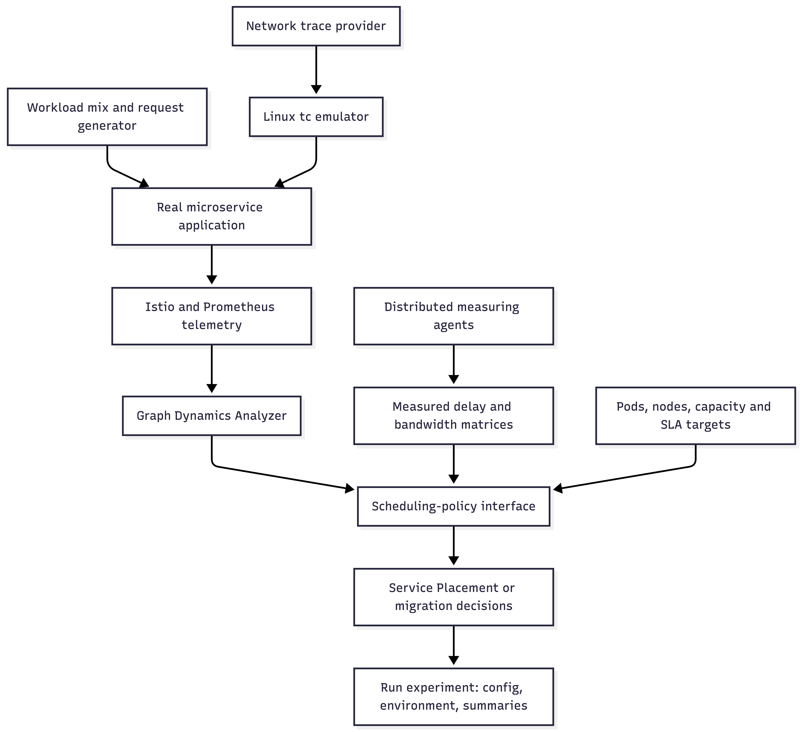

# iDynamics: Controllable Evaluation of Microservice Scheduling Under Cloud-Edge Dynamics

[](https://arxiv.org/abs/2503.16029)
[](https://www.python.org/)
[](https://kubernetes.io/)

iDynamics is an open research framework for running real Kubernetes microservices while making workload mix, call-graph traffic, cross-node latency and bandwidth controllable and repeatable. It is built to answer a practical question: **how does a scheduling policy behave when the hot request path and the network both change over time?**

The framework combines runtime telemetry, network emulation and a pluggable scheduling-policy interface. It supports live-cluster experiments and cluster-free replay workflows, with configuration and evidence retained in per-run ledgers.

**Manuscript:** *iDynamics: A Configurable Emulation Framework for Evaluating Microservice Scheduling Policies under Controllable Cloud-Edge Dynamics*, IEEE Transactions on Services Computing, under second review, 2026.  
**Paper:** <https://arxiv.org/abs/2503.16029>  
**First author:** Ming Chen


---

## Results at a glance

The revised study evaluates iDynamics on a Kubernetes testbed with one control-plane node and 45 worker nodes. The following are experimental measurements from that setup, not production guarantees.

| Measurement                                       |              Reported result |
| ------------------------------------------------- | ---------------------------: |
| Live Graph Dynamics Analyzer, Social Network      | 10.354 ms p95 total overhead |
| Live Graph Dynamics Analyzer, Online Boutique     | 11.405 ms p95 total overhead |
| Local graph build for both live benchmarks        |             Below 0.6 ms p95 |
| Sparse synthetic graph, 50K services / 200K edges |   2696.727 ms p95 build time |
| Cross-node delay injection                        | 0.274 ms mean absolute error |
| Bandwidth shaping                                 |    4.28% mean relative error |

The live call-graph path uses two aggregate Prometheus queries instead of a logical dense pairwise query pattern. The synthetic scaling study isolates local sparse graph construction and does not issue live Prometheus queries.

---

## Why iDynamics

Distributed service performance changes for several reasons at once:

- the mix of request types changes;
- different requests activate different service paths;
- traffic becomes concentrated on a few upstream/downstream pairs;
- latency or available bandwidth changes between cluster nodes; and
- a scheduler reacts by placing or migrating service instances.

Without controlled inputs and retained evidence, a latency change is hard to attribute. iDynamics turns those sources of variation into explicit experiment parameters while keeping real containers, Kubernetes scheduling, service-mesh telemetry and Linux networking in the loop.

## Architecture
### Flowchart at a glance


---


### Graph Dynamics Analyzer

- Reads aggregate Istio/Prometheus traffic telemetry.
- Reconstructs active directed call graphs.
- Computes bidirectional traffic stress for service pairs.
- Tracks weighted edge movement and hotspot churn across time.

### Networking Dynamics Manager

- Generates or replays directed latency and bandwidth matrices.
- Applies destination-specific Linux `tc/qdisc` rules.
- Uses distributed Kubernetes agents to verify resulting conditions.
- Preserves configured control-plane and non-experimental channels.

### Scheduling Policy Extender

- Exposes typed service-graph, node, pod and network inputs.
- Supports auditable placement and migration decisions.
- Includes call-graph-aware and hybrid traffic/network policy examples.
- Separates policy logic from workload and telemetry adapters.

## Supported workloads

| Workload                      | Purpose                                                                  | Entry point                   |
| ----------------------------- | ------------------------------------------------------------------------ | ----------------------------- |
| DeathStarBench Social Network | Dynamic request types and service call graphs                            | `benchmarks/social-network/`  |
| Online Boutique               | External Kubernetes-native application generality                        | `benchmarks/online-boutique/` |
| Sock Shop                     | Additional benchmark adapter and workload path                           | `benchmarks/sock-shop/`       |
| CPU-only MoE-style serving    | Dynamic routing, expert skew, fan-out/fan-in, cache and payload behavior | `benchmarks/moe-serving/`     |

## MoE (Mixture of Experts) serving example

The repository includes a role-selectable Python HTTP service graph:

```text
frontend -> tokenizer -> router -> expert-0..expert-N -> aggregator -> cache
```

It provides:

- JSON request/response paths;
- health and Prometheus-style metrics endpoints;
- changing expert-popularity distributions;
- top-k routing and fan-out/fan-in traffic;
- cache hit/miss behavior;
- payload and batch-size variation;
- cluster-free dry runs and live Kubernetes deployment; and
- replay/live evidence written to run ledgers.

**Boundary:** this is a CPU-only service-graph microbenchmark. It is not a faithful neural-network MoE implementation and does not measure GPU kernels, model weights, KV-cache placement, tensor parallelism or production LLM inference throughput.

## Quick checks without a cluster

Clone the repository:

```bash
git clone https://github.com/Cloudslab/iDynamics.git
cd iDynamics
```

Generate a dry-run MoE request mix:

```bash
python3 examples/moe-serving/workload/generate_load.py \
  --dry-run \
  --requests 12 \
  --experts 4 \
  --skew-mode markov \
  --output /tmp/moe-dry-run.csv
```

Render Kubernetes manifests without deploying them:

```bash
benchmarks/moe-serving/scripts/render.sh
```

After fixing the known repository-root defect in `test_continuous_longmix.py`, run the tests from the repository root with:

```bash
python3 -m pytest -q scripts/experiments/tests
```

In the snapshot reviewed on 1 September 2026, 49 tests pass and one fails because the test constructs a duplicated script path. Re-run and update this statement after the fix.


## Replay experiments

Replay workflows do not mutate a Kubernetes cluster. They use stored or generated dynamics and write a run ledger under `experiments/runs/<run_id>`.

For example:

```bash
IDYN_STAGE=single \
IDYN_SCALE=scale20 \
IDYN_REPLICA_PROFILE=replica3 \
IDYN_MODE=sinusoidal \
IDYN_STEPS=200 \
  benchmarks/moe-serving/scripts/reproduce.sh
```

Every reported policy result should state whether it comes from replay, a live query path or a physical Kubernetes deployment.

## Live Kubernetes experiments

Live experiments require:

- Python 3.10 or newer;
- a Linux Kubernetes cluster;
- `kubectl` access and permission to deploy workloads and DaemonSets;
- Calico or another compatible CNI;
- Istio and Prometheus for service traffic telemetry;
- Linux `tc` on worker nodes; and
- careful cleanup of injected network rules.

See the workload-specific guides under `benchmarks/`. A typical MoE deployment flow is:

```bash
MOE_IMAGE=registry.example.com/idynamics/moe-serving:latest \
IDYN_SCALE=scale10 \
IDYN_POLICY=policy2 \
  benchmarks/moe-serving/scripts/deploy.sh

benchmarks/moe-serving/scripts/smoke.sh
benchmarks/moe-serving/scripts/run_load.sh
benchmarks/moe-serving/scripts/collect_metrics.sh
benchmarks/moe-serving/scripts/cleanup.sh
```

Review the generated manifests and target node labels before running these commands on a shared cluster.

## Run ledgers

Experiment drivers retain evidence under `experiments/runs/<run_id>`.

Common files include:

```text
config.yaml           experiment parameters and evidence labels
env/                  environment and cluster snapshots
raw/                  manifests, traces, load output and captured state
processed/            normalised metrics and summaries
summary.md            purpose, status, result and limitations
```

The public repository includes 106 cleaned run folders. Local command logs, debug logs and tool metadata were removed from the public copy; full uncleaned ledgers are retained separately by the project team.

## Repository map

```text
iDynamics/
├── idynamics/                    # Maintained Python abstractions and modules
├── benchmarks/                   # User-facing workload packages
├── examples/moe-serving/         # HTTP MoE-style service and load generator
├── scripts/                      # Cluster, network, experiment and evaluation drivers
├── experiments/runs/             # Cleaned evidence ledgers
├── iDynamicsPackagesModules/     # Legacy research implementation and artifacts
├── IEEE_TSC_iDynamics_Revision.pdf
└── pyproject.toml
```

The modern package and the legacy tree currently coexist for research traceability. New users should start with `idynamics/`, `benchmarks/`, `examples/` and `scripts/`.

## Reproduction and evidence boundaries

- The 46-node setup is a university research testbed hosted on virtual machines.
- Network dynamics are emulated with Linux traffic control on a Calico overlay.
- Service-mesh telemetry introduces measurable overhead that depends on configuration and request paths.
- Replay results are useful for controlled policy comparison but are not live production measurements.
- The example policies demonstrate the framework; they are not claimed to be universally optimal.
- Large live experiments require cluster privileges and should not be run on shared infrastructure without review.

## Current repository work before a packaged release

- Update `pyproject.toml` to install the modern `idynamics` package.
- Declare and pin direct and development dependencies.
- Fix the remaining test root-path error and add clean-checkout CI.
- Resolve the MIT metadata versus missing root `LICENSE` file.
- Separate or archive large legacy artifacts and run datasets where practical.
- Tag a stable release that corresponds to the revised manuscript.

## Citation

```bibtex
@misc{chen2026idynamics,
  author        = {Chen, Ming and Islam, Muhammed Tawfiqul and {Rodriguez Read}, Maria and Buyya, Rajkumar},
  title         = {{iDynamics}: A Configurable Emulation Framework for Evaluating Microservice Scheduling Policies under Controllable Cloud--Edge Dynamics},
  year          = {2026},
  eprint        = {2503.16029},
  archivePrefix = {arXiv},
  primaryClass  = {cs.DC},
  url           = {https://arxiv.org/abs/2503.16029}
}
```


