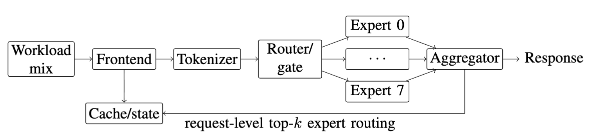

# MoE Serving Benchmark

This directory is the user-facing benchmark package for the iDynamics
CPU-only MoE-style serving microbenchmark. The runnable service, Kubernetes
renderer, and load generator live under `examples/moe-serving`; this directory
provides the benchmark definition, reproduction scripts, adapter metadata, and
artifact guide.

The benchmark models a dynamic mixture-of-experts serving path:

```text
frontend -> tokenizer -> router -> expert-0..expert-N -> aggregator -> cache
```



It is designed to exercise dynamic expert routing, hot-expert shifts,
fan-out/fan-in payload movement, cache hit/miss behavior, and placement policy
decisions. It is not a GPU-aware or production LLM-serving benchmark.

## Directory Layout

- `metadata.yaml`: benchmark identity, supported scales, policies, modes, and
  source paths.
- `adapter/service_map.yaml`: service topology and dynamic expert edges.
- `adapter/workload_mix.yaml`: request types, workload modes, and default load
  settings.
- `adapter/replica_profiles.yaml`: JSON-formatted replica profiles consumed by
  the runners.
- `architecture.md`: service behavior, APIs, policy semantics, and result
  boundaries.
- `deployment.md`: step-by-step replay and live Kubernetes reproduction guide.
- `scripts/`: build, render, deploy, smoke, load, collect, cleanup, and full
  reproduction wrappers.
- `figures/plot_moe_serving.py`: plot policy latency from a run ledger.

## Prerequisites

For replay/control-plane runs:

- Python 3.10 or newer.
- Repository root on `PYTHONPATH` or commands run from the repository root.

For live Kubernetes runs:

- `kubectl` configured for the target cluster.
- Worker nodes labeled for the requested scale, for example
  `idynamics.dev/scale10=true`.
- A container image available to the cluster when using `scripts/deploy.sh`.
  The physical runner can use `python:3.11-slim` with a ConfigMap-mounted
  server and does not require a custom image.
- Optional: metrics-server for `kubectl top`; the scripts continue if it is
  unavailable.

## Quick Checks

Run these from `/home/ubuntu/iDynamics` or another clone root:

```bash
python3 examples/moe-serving/workload/generate_load.py \
  --dry-run \
  --requests 12 \
  --experts 4 \
  --skew-mode markov \
  --output /tmp/moe-dry-run.csv

benchmarks/moe-serving/scripts/render.sh
python3 -m py_compile \
  examples/moe-serving/k8s/render_manifests.py \
  examples/moe-serving/moe_service/server.py \
  examples/moe-serving/workload/generate_load.py
```

## Build The Optional Image

`scripts/deploy.sh` uses the manifest renderer and expects the image to contain
`/app/server.py`. Build it with Docker or Podman:

```bash
MOE_IMAGE=registry.example.com/idynamics/moe-serving:latest \
  benchmarks/moe-serving/scripts/build_image.sh
```

Push when the cluster cannot pull from the local daemon:

```bash
MOE_IMAGE=registry.example.com/idynamics/moe-serving:latest \
IDYN_PUSH_IMAGE=1 \
  benchmarks/moe-serving/scripts/build_image.sh
```

## Replay Reproduction

Replay/control-plane runs do not mutate a Kubernetes cluster. They create a run
ledger under `experiments/runs/<run_id>` and compare Kubernetes default, CGA,
HDA, Policy 2, and Policy 3 over the same fixed-interval MoE request mix:

```bash
IDYN_STAGE=single \
IDYN_SCALE=scale20 \
IDYN_REPLICA_PROFILE=replica3 \
IDYN_MODE=sinusoidal \
IDYN_STEPS=200 \
  benchmarks/moe-serving/scripts/reproduce.sh
```

Run the full Stage A/B/C/D replay campaign:

```bash
IDYN_STAGE=all benchmarks/moe-serving/scripts/reproduce.sh
```

## Live Kubernetes Reproduction

For a single rendered deployment:

```bash
MOE_IMAGE=registry.example.com/idynamics/moe-serving:latest \
IDYN_SCALE=scale10 \
IDYN_POLICY=policy2 \
  benchmarks/moe-serving/scripts/deploy.sh

benchmarks/moe-serving/scripts/smoke.sh
benchmarks/moe-serving/scripts/run_load.sh
benchmarks/moe-serving/scripts/collect_metrics.sh
benchmarks/moe-serving/scripts/cleanup.sh
```

For the physical policy-comparison runner:

```bash
IDYN_LIVE_PHYSICAL=1 \
IDYN_SCALE=scale10 \
IDYN_REPLICA_PROFILE=replica1 \
IDYN_SKEW_MODE=phase_shift \
IDYN_REQUESTS=120 \
IDYN_QPS=10 \
  benchmarks/moe-serving/scripts/reproduce.sh
```

The physical runner applies one policy namespace at a time, archives the
manifests and metrics, and removes namespaces plus temporary placement labels in
cleanup.

## Request Types

- `single_expert`
- `multi_expert_top2`
- `multi_expert_top4`
- `cache_hit`
- `cache_miss`
- `payload_small`
- `payload_large`
- `batch_small`
- `batch_large`

The workload CSV records `request_id`, `request_type`, `status`, `latency_ms`,
selected experts, `top_k`, payload size, batch size, cache intent, hot expert,
expert-popularity vector, cache key, and error text.

## Workload Modes

Supported modes are:

- `step`
- `linear`
- `sinusoidal`
- `markov`
- `expert_skew_shift`
- `cache_stress`
- `payload_heavy`

The live physical runner also accepts the compatibility aliases `phase-shift`,
`phase_shift`, `stable`, and `burst`.

## Main Artifacts

Replay ledgers usually include:

- `config.yaml`
- `commands.log`
- `raw/expert_popularity_timeseries.csv`
- `raw/request_mix_timeseries.csv`
- `raw/application_policy_timeseries.csv`
- `processed/gda_runtime_summary.csv`
- `summary.md`

Live physical ledgers usually include:

- `raw/*_manifest.yaml`
- `raw/*_loadgen.csv`
- `raw/*_pods.json`
- `processed/*_planner_output.json`
- `processed/physical_moe_metrics.json`
- `env/temporary_placement_labels.json`
- `summary.md`

Plot a completed ledger with:

```bash
python3 benchmarks/moe-serving/figures/plot_moe_serving.py \
  experiments/runs/<run_id>
```

## Result Boundary

This benchmark supports CPU-only MoE-style microservice evidence: dynamic
routing, expert skew, fan-out/fan-in, payload movement, cache effects, and
placement-policy behavior. It does not support conclusions about GPU kernels,
KV-cache placement, tensor parallelism, model weights, or production LLM
inference performance.
