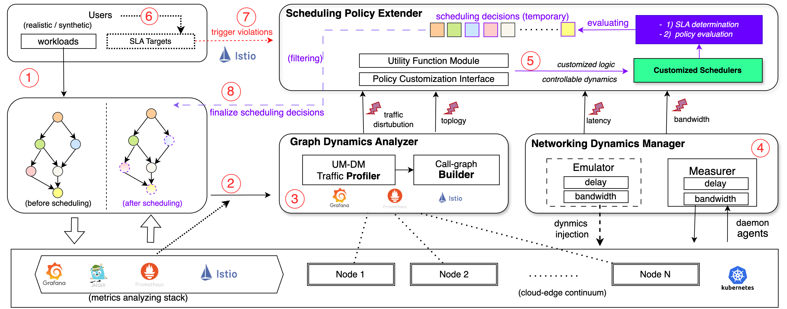
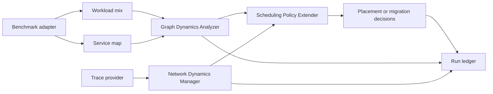
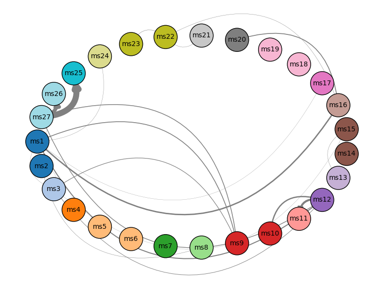
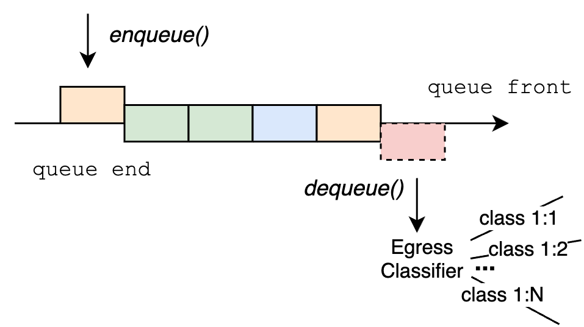
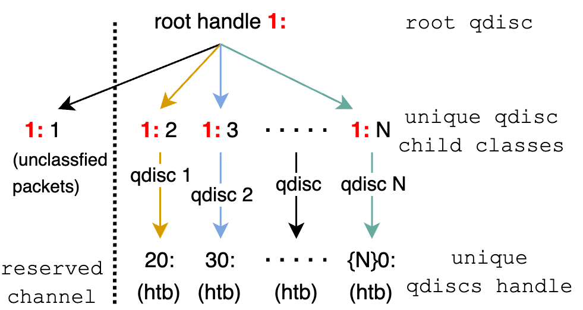
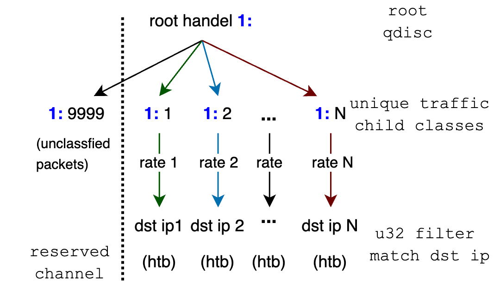
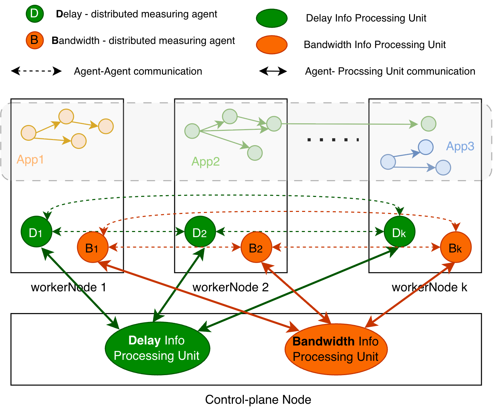
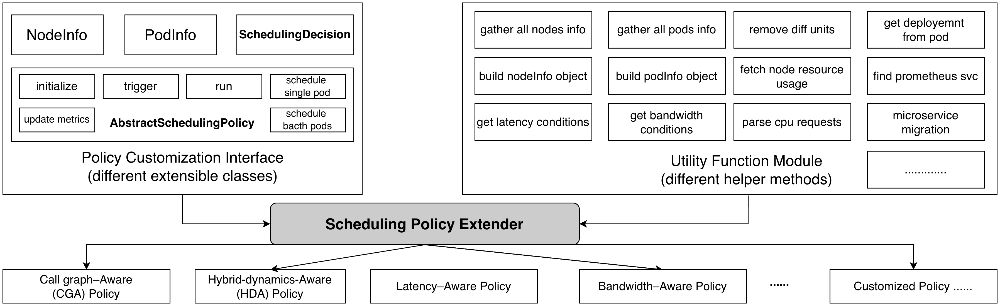

# Architecture

[Documentation index](index.md) | [Quickstart](quickstart.md) | [Policy development](policy-development.md) | [Reproducibility](reproducibility.md)

iDynamics is organized around a small set of testable Python APIs, benchmark
adapter folders, and live-cluster helper scripts. The modern package namespace is
`idynamics`; `iDynamicsPackagesModules` remains as a compatibility namespace for
legacy scripts that still import the original module names.

## System Flow

## Package Layout

The repository uses a `src/` package layout:

- `src/idynamics/` contains the current public API.
- `src/iDynamicsPackagesModules/` preserves import compatibility for legacy
  components that have not yet been fully moved.
- `benchmarks/` contains benchmark adapters and cluster helper scripts.
- `reproducibility/` contains curated data-only artifacts and diagram assets.
- `scripts/` contains policy and evaluation entry points.
- `tests/` contains offline unit and integration-style checks.

Historical notebooks, raw cluster logs, bytecode caches, access material, and
large run ledgers are intentionally outside the package namespace.

## Graph Dynamics Analyzer

The Graph Dynamics Analyzer (GDA) reconstructs a weighted service graph from
observed application traffic. Its current sparse implementation is exposed
through `idynamics.gda.sparse` and backed by
`iDynamicsPackagesModules.GraphDynamicsAnalyzer.sparse_graph_builder`.

The main inputs are:

- a benchmark service inventory, usually from `adapter/service_map.yaml`;
- Prometheus or compatible service-mesh telemetry;
- a time window such as `10m`;
- an optional minimum stress threshold.

The sparse GDA path issues two aggregate PromQL queries over source and
destination workload labels, merges sent and received byte series, filters
inactive pairs, and builds a directed weighted graph. This avoids the older
pairwise scan that scaled with every ordered service pair.

GDA metrics in `idynamics.gda.metrics` include active edge count, aggregate
traffic stress, weighted edge distance, top-hotspot churn, entropy, skew, and
SLA pressure helpers. These metrics describe graph and workload movement; they
do not by themselves prove scheduler performance.

## Network Dynamics Manager

The Network Dynamics Manager (NDM) separates network-state generation or replay
from live traffic-control mutation.

Trace providers in `idynamics.network.traces` yield time-indexed latency and
bandwidth matrices:

- `SyntheticDistanceRandomProvider` generates deterministic distance-shaped
  matrices from a seed.
- `BurstCorrelatedProvider` generates bursty traces with temporal and spatial
  correlation.
- `CsvMatrixReplayProvider` replays committed or external matrix CSV files.

The legacy NDM compatibility modules provide live delay and bandwidth injection
helpers using Linux traffic control, plus measurement helpers for validating
cross-node latency and saturated bandwidth. These operations require a prepared
Kubernetes testbed, node permissions, and careful cleanup.

## Scheduling Policy Extender

The Scheduling Policy Extender (SPE) is the policy-facing boundary. The modern
protocol is `idynamics.policies.interface.SchedulingPolicy`:

- input: `PodInfo`, `NodeInfo`, optional `ServiceGraph`, optional `NetworkMatrix`;
- output: auditable `SchedulingDecision` objects;
- planner entry point: `scripts/policies/run_policy.py`.

The built-in planners in `idynamics.policies.planner` include the two
manuscript-facing reference policies plus two auxiliary extension examples:

- CGA, represented by `Policy1TrafficAffinity`, minimizes high-stress
  cross-node call-graph edges.
- `Policy2LatencyCriticalPath` is an auxiliary latency-critical-path example.
- `Policy3BandwidthPayloadAware` is an auxiliary bandwidth-payload-aware
  example.
- HDA, represented by `Policy4HybridDynamics`, combines call-graph stress,
  latency, and bandwidth in one objective.

The legacy SPE interface remains available as
`iDynamicsPackagesModules.SchedulingPolicyExtender.my_policy_interface` for
older policy implementations.

## Benchmark Adapters

Each benchmark adapter defines the application boundary that GDA and policy code
consume:

- `metadata.yaml` records source, pinned commit or local implementation,
  license, namespace, entry service, and known limitations.
- `adapter/service_map.yaml` records service names and edges.
- `adapter/workload_mix.yaml` records request classes and load-path weights.
- `adapter/replica_profiles.yaml` records replica-shape presets.
- `scripts/*.sh` fetch, deploy, smoke, load, collect, clean up, or run a
  packaged reproduce pass.

The [benchmark guide](benchmark-guide.md) lists the current benchmark matrix and
evidence boundaries for primary, compatibility, and CPU-only workloads.

## Run Ledgers

`idynamics.ledger.run` creates a standard run ledger under
`experiments/runs/<run-id>` with:

- `config.yaml`;
- `commands.log`;
- `git_sha.txt`;
- `git_status.txt`;
- `environment.txt`;
- `summary.md`;
- `paper_claims.md`;
- `raw/`, `processed/`, `figures/`, `logs/`, and `env/`.

Ledgers are the bridge between live experiments and paper-facing artifacts. A
result should not be promoted beyond smoke or compatibility evidence unless its
ledger records the configuration, commands, code state, raw outputs, and
processing path.

## Evidence Types

iDynamics keeps evidence classes separate:

| Evidence type | Meaning | Typical locations |
| --- | --- | --- |
| Live physical | A Kubernetes or network testbed actually ran the workload, telemetry, or traffic-control validation. | Run ledgers; selected artifact inputs. |
| Replay | Policies or figures were regenerated from captured or generated traces without rerunning the full physical system. | `reproducibility/items/*/data`, replay scripts. |
| Synthetic control-plane | Local graph construction, query-count, planner, or trace-generation behavior without application latency claims. | GDA synthetic rows, trace-provider metrics, tests. |
| Compatibility | Adapters deploy, smoke, collect, or package an application, but do not establish comparative performance by themselves. | `benchmarks/*`, manual smoke/load outputs. |
| CPU-only MoE | Repository-local benchmark that models MoE-style service communication with CPU work only. | `benchmarks/moe-serving`, Figure 9 artifacts. |

See [Paper and evidence guide](paper.md) for the artifact map and claim
boundaries.
