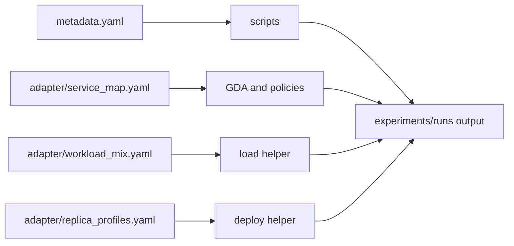

# Benchmark Guide

[Documentation index](index.md) | [Quickstart](quickstart.md) | [Reproducibility](reproducibility.md)

The benchmark library uses small iDynamics adapter folders plus fetch scripts.
Third-party sources are checked out under `external/benchmarks/` at pinned
commits and are not vendored into this repository.

## Benchmark Matrix

| Benchmark | Folder | Source | Pinned commit | License | Namespace | Status | Evidence role |
| --- | --- | --- | --- | --- | --- | --- | --- |
| Social Network | `benchmarks/social-network` | DeathStarBench | `6ecb09706140f8730b5385c08f1386c654c3c526` | Apache-2.0 | `idyn-social-network` | packaged adapter | Requested real benchmark; performance evidence requires a complete run ledger. |
| Online Boutique | `benchmarks/online-boutique` | Google Microservices Demo | `5096a85b2f3bf41bef53363cfe5478d5b86ac701` | Apache-2.0 | `idyn-online-boutique` | primary adapter | Real application adapter used for live or replay-backed generality evidence. |
| MoE Serving | `benchmarks/moe-serving` | repository-local | not applicable | repository package metadata: MIT | `idyn-moe-serving` | primary CPU-only microbenchmark | CPU-only MoE-style routing and communication benchmark; no GPU or model-weight claim. |
| DeathStarBench Hotel | `benchmarks/deathstar-hotel` | DeathStarBench | `6ecb09706140f8730b5385c08f1386c654c3c526` | Apache-2.0 | `idyn-dsb-hotel` | compatibility adapter | Compatibility evidence unless a full run ledger is produced. |
| TrainTicket | `benchmarks/train-ticket` | TrainTicket | `313886e99befb94be6cd45f085c98e0019f59829` | Apache-2.0 | `idyn-train-ticket` | complex compatibility adapter | Large-footprint compatibility evidence unless a full workload trace and ledger are supplied. |
| Sock Shop | `benchmarks/sock-shop` | Sock Shop | `9dff06fae4981921caec6a62393a6ebfce4b3e3f` | Apache-2.0 | `idyn-sock-shop` | archived compatibility adapter | Deprecated-upstream compatibility coverage. |

## Adapter Flow



## Folder Contract

Each benchmark folder contains:

- `README.md`;
- `metadata.yaml`;
- `adapter/service_map.yaml`;
- `adapter/workload_mix.yaml`;
- `adapter/replica_profiles.yaml`;
- `overlays/idynamics/README.md`;
- `scripts/fetch.sh`;
- `scripts/deploy.sh`;
- `scripts/smoke.sh`;
- `scripts/load.sh`;
- `scripts/collect.sh`;
- `scripts/cleanup.sh`;
- `scripts/reproduce.sh`.

All scripts support `--help`, run with Bash fail-fast settings, and validate
that mutable Kubernetes work is scoped to an `idyn-*` namespace. `cleanup.sh`
deletes only the validated benchmark namespace.

## Typical Flow

```bash
benchmarks/online-boutique/scripts/fetch.sh
benchmarks/online-boutique/scripts/deploy.sh --namespace idyn-online-boutique
benchmarks/online-boutique/scripts/smoke.sh --namespace idyn-online-boutique
benchmarks/online-boutique/scripts/load.sh --namespace idyn-online-boutique --duration 45 --concurrency 8
benchmarks/online-boutique/scripts/collect.sh --namespace idyn-online-boutique --output-dir experiments/runs/online-boutique-manual
benchmarks/online-boutique/scripts/cleanup.sh --namespace idyn-online-boutique
```

For a single packaged pass, use `reproduce.sh`. Set `IDYN_CLEANUP=1` to clean
up the namespace after collection.

## Evidence Boundaries

Manual smoke/load helpers validate packaging and operational readiness. They do
not by themselves establish comparative performance results. Any performance
claim should preserve the benchmark folder, upstream commit, namespace, cluster
configuration, load parameters, raw output, and processing scripts used for that
specific run.

Use the evidence classes from [Reproducibility](reproducibility.md#evidence-types):

- Live physical evidence requires a named run ledger and testbed context.
- Replay evidence requires committed or archived trace inputs and deterministic
  processing scripts.
- Synthetic control-plane evidence must stay scoped to local algorithms,
  generated traces, or planner behavior.
- Compatibility evidence covers adapter and script readiness.
- CPU-only MoE evidence is limited to the repository-local MoE-style benchmark.

## Benchmark-Specific Notes

Social Network and DeathStarBench Hotel include stateful services such as
databases, caches, and tracing components. Startup and readiness can dominate
manual smoke time.

Online Boutique is Kubernetes-native but may still require image registry
access from the target cluster. Its HTTP frontend load path does not exercise
every internal edge directly.

TrainTicket has a large service and database footprint. Start with longer
rollout timeouts and treat HTTP smoke/load scaffolding as compatibility evidence
unless a full workload trace is supplied.

Sock Shop is archived upstream. It remains useful for adapter compatibility
checks, but it is not a primary modern benchmark.

MoE Serving is local and CPU-only. It models routing, fan-out, fan-in, payload,
cache, and bounded CPU work with standard Python HTTP services.
