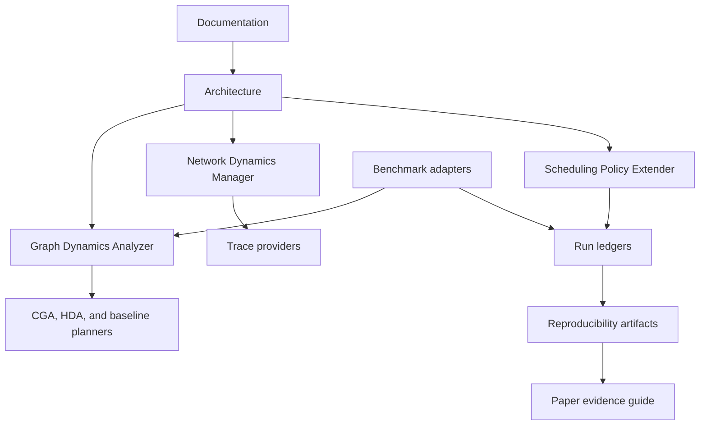

# Documentation

This documentation describes the public repository, package APIs, benchmark
adapters, and reproducibility artifacts.

## Pages

- [Architecture](architecture.md): component layout, data flow, diagrams, and
  evidence classes.
- [Installation](installation.md): local Python setup and optional live-cluster
  dependencies.
- [Quickstart](quickstart.md): first offline policy run, artifact smoke check,
  and benchmark smoke path.
- [Configuration](configuration.md): package extras, benchmark environment
  variables, adapter files, trace providers, policy input JSON, and run ledgers.
- [Policy development](policy-development.md): CGA, HDA, built-in planners,
  modern policy protocol, legacy compatibility, and tests.
- [Benchmark guide](benchmark-guide.md): benchmark matrix, adapter contract, and
  evidence boundaries.
- [Reproducibility](reproducibility.md): data-only artifacts, full-cluster
  plans, checksums, and evidence taxonomy.
- [Troubleshooting](troubleshooting.md): common local, benchmark, cluster,
  network, policy, and artifact issues.
- [Paper and evidence guide](paper.md): paper-facing component names, artifact
  map, and claim boundaries.
- [Changelog and versioning](../CHANGELOG.md): release notes and package
  versioning guidance.
- [Release preparation](release-preparation.md): release-candidate checklist,
  artifact manifest, and large-data archive requirements.

## Component Map

## Repository Shortcuts

- Package source: [`../src/idynamics`](../src/idynamics)
- Benchmark adapters: [`../benchmarks`](../benchmarks)
- Artifact package: [`../reproducibility`](../reproducibility)
- Diagram assets: [`../reproducibility/diagrams`](../reproducibility/diagrams)
- Policy CLI: [`../scripts/policies/run_policy.py`](../scripts/policies/run_policy.py)
- Tests: [`../tests`](../tests)
- Changelog: [`../CHANGELOG.md`](../CHANGELOG.md)
- Release notes: [`../RELEASE_NOTES.md`](../RELEASE_NOTES.md)
